// ✅ 一、通用功能 API 设计

/**
 * 用户注册 / 登录 / 退出登录
 */
POST /api/auth/register
- 参数： username, password, phone, code 
- 返回： success, message, userId 

POST /api/auth/login
- 参数： usernameOrPhone, password 
- 返回： token, userInfo 

POST /api/auth/login/sms
- 参数： phone, code 
- 返回： token, userInfo 

POST /api/auth/logout
- Header: Authorization
- 返回： success 

/**
 * 用户信息管理
 */
GET /api/user/profile
- Header: Authorization
- 返回： userInfo 

PUT /api/user/profile
- Header: Authorization
- 参数： nickname, avatar, gender, department, major, ... 
- 返回： success 

PUT /api/user/password
- Header: Authorization
- 参数： oldPassword, newPassword 
- 返回： success, message 

/**
 * 消息通知中心
 */
GET /api/notifications
- Header: Authorization
- 查询参数： page, size, type 
- 返回： notifications: [], total 

POST /api/notifications/read
- Header: Authorization
- 参数： ids: [] 
- 返回： success 

/**
 * 搜索
 */
GET /api/search
- 参数： keyword, type (公告/帖子/资源等), page, size 
- 返回： results: [], total 

/**
 * 意见反馈与帮助中心
 */
POST /api/feedback
- Header: Authorization
- 参数： type, content, contact 
- 返回： success 

GET /api/help/articles
- 参数： category, page, size 
- 返回： articles: [], total 

/**
 * 多语言支持（客户端处理为主）
 */
GET /api/i18n/resources
- 参数： lang 
- 返回： translations:  key: value  

/**
 * 黑夜/白天模式（客户端存储为主）
 */
// 不涉及服务端 API

/**
 * WebSocket 连接
 */
WebSocket /ws/notifications
- Header: Authorization (token)
- 用于接收实时消息通知

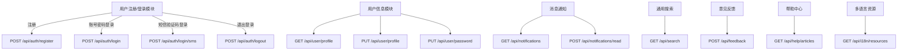

// ✅ 二、用户端功能 API 设计

/**
 * 🎓 1. 个人中心
 */
GET /api/user/center
- Header: Authorization
- 返回： profile, stats, recentActivities 

GET /api/user/favorites
- Header: Authorization
- 查询参数： type, page, size 
- 返回： items: [], total 

DELETE /api/user/favorites/id
- Header: Authorization
- 返回： success 

GET /api/user/history
- Header: Authorization
- 查询参数： type, page, size 
- 返回： items: [], total 

GET /api/user/messages
- Header: Authorization
- 查询参数： page, size 
- 返回： messages: [], total 

PUT /api/user/messages/read
- Header: Authorization
- 参数： ids: [] 
- 返回： success 

GET /api/user/medals
- Header: Authorization
- 返回： medals: [], level, points 

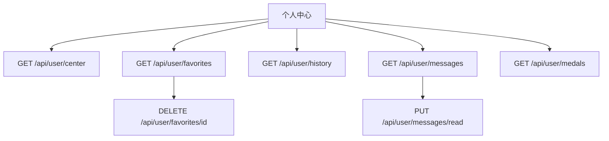

/**
 * 📢 2. 校园信息服务
 */
GET /api/campus/news
- 参数： category, page, size 
- 返回： news: [], total 

GET /api/campus/news/id
- 返回： id, title, content, author, publishedAt 

GET /api/campus/announcements
- 参数： type, page, size 
- 返回： announcements: [], total 

GET /api/campus/calendar
- 参数： month 
- 返回： events: [ date, title, type ] 

GET /api/campus/alerts
- 返回： alerts: [ id, content, level, createdAt ] 

GET /api/campus/banners
- 返回： banners: [ id, imageUrl, link ] 

GET /api/campus/events
- 参数： category, page, size 
- 返回： events: [], total 

GET /api/campus/events/id
- 返回： title, detail, location, time, organizer, participants 

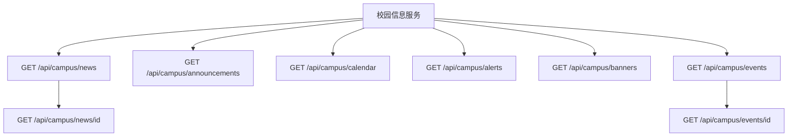

// 接下来将继续设计 “📚 教务服务模块” 所有功能 API。是否继续？

/**
 * 📚 3. 教务服务模块
 */

// 课表
GET /api/edu/timetable
- Header: Authorization
- 参数： week, term 
- 返回： courses: [ courseName, location, dayOfWeek, startTime, endTime, teacher ] 

// 成绩查询
GET /api/edu/grades
- Header: Authorization
- 参数： term 
- 返回： grades: [ courseName, score, gpa, credit ] 

// 选课模块
GET /api/edu/courses
- Header: Authorization
- 查询参数： term, department, page, size 
- 返回： courses: [ id, name, teacher, capacity, enrolled ] 

GET /api/edu/courses/id
- Header: Authorization
- 返回： id, name, teacher, schedule, description, credits, location, capacity, enrolled 

POST /api/edu/courses/enroll
- Header: Authorization
- 参数： courseId 
- 返回： success, message 

DELETE /api/edu/courses/drop/id
- Header: Authorization
- 返回： success, message 

// 我的课程列表
GET /api/edu/my-courses
- Header: Authorization
- 参数： term 
- 返回： courses: [ id, name, teacher, schedule ] 

// 考试安排
GET /api/edu/exams
- Header: Authorization
- 参数： term 
- 返回： exams: [ courseName, date, time, location ] 

// 教务通知
GET /api/edu/notices
- 参数： page, size 
- 返回： notices: [ id, title, content, publishedAt ] 

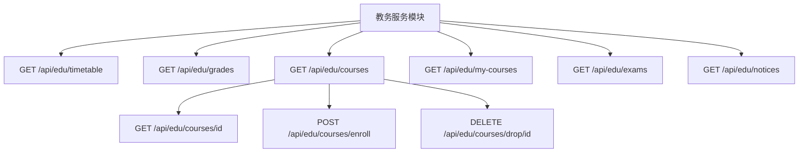

// 接下来将继续设计 “💬 交流互动模块” 所有功能 API。是否继续？

/**
 * 💬 4. 交流互动模块
 */

// 获取帖子列表
GET /api/forum/posts
- 参数： category, page, size, keyword 
- 返回： posts: [ id, title, author, views, likes, comments, createdAt ], total 

// 获取帖子详情
GET /api/forum/posts/id
- 返回： id, title, content, author, createdAt, views, likes, isLiked, comments: [] 

// 发布帖子
POST /api/forum/posts
- Header: Authorization
- 参数： title, content, category 
- 返回： success, postId 

// 编辑帖子
PUT /api/forum/posts/id
- Header: Authorization
- 参数： title, content, category 
- 返回： success 

// 删除帖子
DELETE /api/forum/posts/id
- Header: Authorization
- 返回： success 

// 点赞帖子
POST /api/forum/posts/id/like
- Header: Authorization
- 返回： success, liked 

// 评论帖子
POST /api/forum/comments
- Header: Authorization
- 参数： postId, content, parentId (可选) 
- 返回： success, commentId 

// 删除评论
DELETE /api/forum/comments/id
- Header: Authorization
- 返回： success 

// 举报帖子或评论
POST /api/forum/report
- Header: Authorization
- 参数： targetType: 'post' | 'comment', targetId, reason 
- 返回： success 

// 我的发帖记录
GET /api/forum/my-posts
- Header: Authorization
- 参数： page, size 
- 返回： posts: [], total 

// 我的评论记录
GET /api/forum/my-comments
- Header: Authorization
- 参数： page, size 
- 返回： comments: [], total 

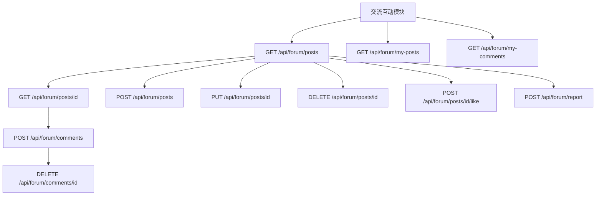

// 接下来将继续设计 “📂 资源共享模块” 所有功能 API。是否继续？

/**
 * 📂 5. 资源共享模块
 */

// 上传资源文件
POST /api/resource/upload
- Header: Authorization
- Content-Type: multipart/form-data
- 参数： file, title, description, tags, category 
- 返回： success, resourceId 

// 获取资源列表
GET /api/resource/list
- 参数： page, size, category, keyword, uploaderId 
- 返回： resources: [ id, title, uploader, downloadCount, tags, createdAt ], total 

// 获取资源详情
GET /api/resource/id
- 返回： id, title, description, uploader, tags, fileUrl, downloadCount, createdAt 

// 下载资源
GET /api/resource/id/download
- Header: Authorization
- 返回：文件流

// 删除资源
DELETE /api/resource/id
- Header: Authorization
- 返回： success 

// 编辑资源信息
PUT /api/resource/id
- Header: Authorization
- 参数： title, description, tags, category 
- 返回： success 

// 点赞资源
POST /api/resource/id/like
- Header: Authorization
- 返回： success, liked 

// 举报资源
POST /api/resource/report
- Header: Authorization
- 参数： resourceId, reason 
- 返回： success 

// 获取我上传的资源
GET /api/resource/my-uploads
- Header: Authorization
- 参数： page, size 
- 返回： resources: [], total 

// 获取我下载的资源
GET /api/resource/my-downloads
- Header: Authorization
- 参数： page, size 
- 返回： resources: [], total 

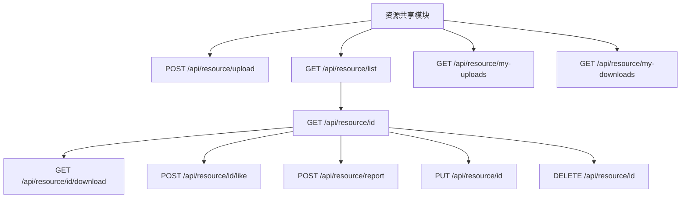

// 接下来将继续设计 “🧾 事务服务模块” 所有功能 API。是否继续？

/**
 * 🧾 6. 事务服务模块
 */

// 提交请假申请
POST /api/affair/leave/apply
- Header: Authorization
- 参数： type, reason, startTime, endTime 
- 返回： success, applicationId 

// 查询我的请假记录
GET /api/affair/leave/my
- Header: Authorization
- 参数： page, size 
- 返回： applications: [ id, type, status, startTime, endTime, createdAt ], total 

// 管理员审批请假
PUT /api/affair/leave/approve/id
- Header: Authorization (管理员)
- 参数： approve: true|false, remark 
- 返回： success 

// 提交报修申请
POST /api/affair/repair/report
- Header: Authorization
- 参数： title, description, location, images 
- 返回： success, reportId 

// 查询我的报修记录
GET /api/affair/repair/my
- Header: Authorization
- 返回： repairs: [ id, title, status, createdAt ] 

// 获取报修列表（管理）
GET /api/affair/repair/list
- Header: Authorization (管理员)
- 参数： status, page, size 
- 返回： repairs: [ id, title, reporter, location, status, createdAt ] 

// 处理报修任务
PUT /api/affair/repair/handle/id
- Header: Authorization (管理员)
- 参数： status: '处理中' | '已完成' | '驳回', reply 
- 返回： success 

// 办事预约申请（如辅导员面谈）
POST /api/affair/appointment/apply
- Header: Authorization
- 参数： title, content, preferredTime 
- 返回： success, appointmentId 

// 我的预约记录
GET /api/affair/appointment/my
- Header: Authorization
- 返回： appointments: [ id, title, status, preferredTime, createdAt ] 

// 管理预约申请
GET /api/affair/appointment/list
- Header: Authorization (管理员)
- 参数： status, page, size 
- 返回： appointments: [ id, applicant, title, preferredTime, status ] 

// 审核预约申请
PUT /api/affair/appointment/handle/id
- Header: Authorization (管理员)
- 参数： approve: true|false, remark 
- 返回： success 

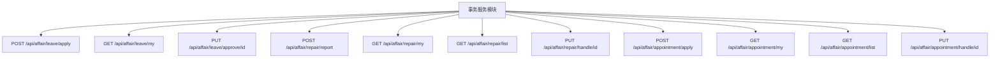

// 接下来将继续设计 “🎓 学生成长模块” 所有功能 API。是否继续？

/**
 * 🎓 7. 学生成长模块
 */

// 添加成长记录（自定义成长事件）
POST /api/growth/record/add
- Header: Authorization
- 参数： title, content, date, type 
- 返回： success, recordId 

// 获取成长记录列表
GET /api/growth/record/list
- Header: Authorization
- 参数： page, size, type 
- 返回： records: [ id, title, type, date, createdAt ], total 

// 获取成长记录详情
GET /api/growth/record/id
- Header: Authorization
- 返回： id, title, content, date, type 

// 删除成长记录
DELETE /api/growth/record/id
- Header: Authorization
- 返回： success 

// 学习/技能打卡提交
POST /api/growth/checkin
- Header: Authorization
- 参数： skillType, description, duration, date 
- 返回： success, checkinId 

// 获取打卡记录
GET /api/growth/checkin/list
- Header: Authorization
- 参数： page, size, skillType, dateRange 
- 返回： checkins: [ id, skillType, description, duration, date ] 

// 添加荣誉/奖项
POST /api/growth/honor/add
- Header: Authorization
- 参数： title, issuer, date, description 
- 返回： success, honorId 

// 获取我的荣誉列表
GET /api/growth/honor/list
- Header: Authorization
- 返回： honors: [ id, title, issuer, date, description ] 

// 删除荣誉
DELETE /api/growth/honor/id
- Header: Authorization
- 返回： success 

// 学生成长统计图表数据（用于可视化）
GET /api/growth/stats/overview
- Header: Authorization
- 返回：
    totalCheckins,
    totalGrowthRecords,
    totalHonors,
    recentCheckins: [ date, duration ],
    recordDistribution: [ type, count ]
  

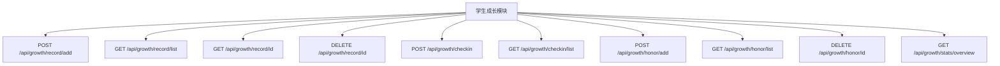

// 接下来将继续设计 “👨‍🏫 管理端功能模块” 所有功能 API。是否继续？

/**
 * 👨‍🏫 8. 管理端功能模块
 */

// 获取用户列表
GET /api/admin/user/list
- Header: Authorization (管理员)
- 参数： role, keyword, page, size 
- 返回： users: [ id, name, role, status, createdAt ], total 

// 修改用户状态（启用/禁用）
PUT /api/admin/user/status/id
- Header: Authorization (管理员)
- 参数： enabled: true|false 
- 返回： success 

// 创建新用户（例如导入老师/管理员）
POST /api/admin/user/create
- Header: Authorization (管理员)
- 参数： name, username, role, password 
- 返回： success, userId 

// 获取角色列表
GET /api/admin/role/list
- Header: Authorization (管理员)
- 返回： roles: [ id, name, permissions ] 

// 更新角色权限
PUT /api/admin/role/update/id
- Header: Authorization (管理员)
- 参数： permissions: [...] 
- 返回： success 

// 获取操作日志
GET /api/admin/logs/operation
- Header: Authorization (管理员)
- 参数： page, size, userId, dateRange 
- 返回： logs: [ id, user, action, timestamp ] 

// 获取访问日志
GET /api/admin/logs/access
- Header: Authorization (管理员)
- 参数： page, size, ip, endpoint, dateRange 
- 返回： logs: [ id, ip, endpoint, timestamp ] 

// 系统统计概览（仪表盘）
GET /api/admin/stats/overview
- Header: Authorization (管理员)
- 返回：
    userCount,
    dailyActive,
    contentCount,
    reportCount,
    systemLoad,
    chartUserGrowth: [ date, count ]
  

// 获取反馈建议列表
GET /api/admin/feedback/list
- Header: Authorization (管理员)
- 参数： status, page, size 
- 返回： feedbacks: [ id, user, content, status, createdAt ] 

// 回复/处理反馈建议
PUT /api/admin/feedback/handle/id
- Header: Authorization (管理员)
- 参数： reply, status: '处理中' | '已解决' | '已忽略' 
- 返回： success 

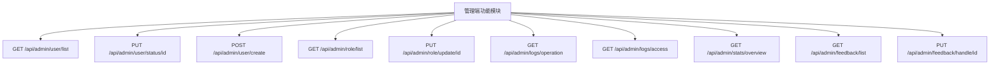

// ✅ 接下来将继续设计 “🧠 AI 服务模块” 所有功能 API。是否继续？

/**
 * 👨‍🏫 8. 管理端功能模块
 */

// 获取用户列表
GET /api/admin/user/list
- Header: Authorization (管理员)
- 参数： role, keyword, page, size 
- 返回： users: [ id, name, role, status, createdAt ], total 

// 修改用户状态（启用/禁用）
PUT /api/admin/user/status/id
- Header: Authorization (管理员)
- 参数： enabled: true|false 
- 返回： success 

// 创建新用户（例如导入老师/管理员）
POST /api/admin/user/create
- Header: Authorization (管理员)
- 参数： name, username, role, password 
- 返回： success, userId 

// 获取角色列表
GET /api/admin/role/list
- Header: Authorization (管理员)
- 返回： roles: [ id, name, permissions ] 

// 更新角色权限
PUT /api/admin/role/update/id
- Header: Authorization (管理员)
- 参数： permissions: [...] 
- 返回： success 

// 获取操作日志
GET /api/admin/logs/operation
- Header: Authorization (管理员)
- 参数： page, size, userId, dateRange 
- 返回： logs: [ id, user, action, timestamp ] 

// 获取访问日志
GET /api/admin/logs/access
- Header: Authorization (管理员)
- 参数： page, size, ip, endpoint, dateRange 
- 返回： logs: [ id, ip, endpoint, timestamp ] 

// 系统统计概览（仪表盘）
GET /api/admin/stats/overview
- Header: Authorization (管理员)
- 返回：
    userCount,
    dailyActive,
    contentCount,
    reportCount,
    systemLoad,
    chartUserGrowth: [ date, count ]
  

// 获取反馈建议列表
GET /api/admin/feedback/list
- Header: Authorization (管理员)
- 参数： status, page, size 
- 返回： feedbacks: [ id, user, content, status, createdAt ] 

// 回复/处理反馈建议
PUT /api/admin/feedback/handle/id
- Header: Authorization (管理员)
- 参数： reply, status: '处理中' | '已解决' | '已忽略' 
- 返回： success 

/**
 * 🧠 9. AI 服务模块
 */

// AI 问答对话
POST /api/ai/chat
- Header: Authorization (用户)
- 参数： message: "当前提问内容", contextId?: "对话上下文ID" 
- 返回： reply: "AI回复内容", contextId: "新的上下文ID" 

// 获取历史对话记录
GET /api/ai/chat/history
- Header: Authorization (用户)
- 参数： page, size 
- 返回： history: [ id, userMessage, aiReply, timestamp ] 

// AI 情绪陪伴（日常关怀）
POST /api/ai/emotion/companion
- Header: Authorization (用户)
- 参数： mood: "string", description?: "详细描述" 
- 返回： message: "AI 关怀回复" 

// 个性化学习推荐
GET /api/ai/learning/recommend
- Header: Authorization (用户)
- 参数： major?, interestTags? 
- 返回： recommendations: [ id, title, type, url ] 

// 智能内容摘要（用于课程或公告总结）
POST /api/ai/summary
- Header: Authorization (教师/管理员)
- 参数： content: "原始文本内容" 
- 返回： summary: "生成摘要" 

// 智能作文评分
POST /api/ai/score/essay
- Header: Authorization (教师)
- 参数： title, content, level 
- 返回： score: 0-100, comments: "AI 评价内容" 

// AI 服务统计（管理端）
GET /api/admin/ai/stats
- Header: Authorization (管理员)
- 返回： totalChats, activeUsers, avgLength, sentimentUsage 

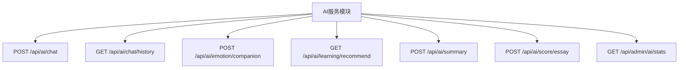

/**
 * 🤝 10. 系统间交互与第三方对接
 */

// 微信登录授权（获取 openid）
POST /api/thirdparty/wechat/login
- 参数： code: "wx.code" 
- 返回： token, userInfo 

// 微信绑定账号
POST /api/thirdparty/wechat/bind
- Header: Authorization (用户)
- 参数： openid 
- 返回： success 

// 教务系统同步成绩
POST /api/thirdparty/edu/sync-grades
- Header: Authorization (管理员)
- 参数： semester 
- 返回： success, syncedCount 

// 教务系统同步课表
POST /api/thirdparty/edu/sync-schedule
- Header: Authorization (管理员)
- 参数： semester 
- 返回： success, syncedCourses 

// 企业微信/钉钉消息推送
POST /api/thirdparty/notify/workapp
- Header: Authorization (管理员)
- 参数： message, receivers, platform: "wechat_work" | "dingtalk" 
- 返回： success 

// IOT设备状态上报
POST /api/thirdparty/iot/device-status
- Header: Authorization (设备系统)
- 参数： deviceId, status, timestamp 
- 返回： success 

// IOT远程控制请求
POST /api/thirdparty/iot/command
- Header: Authorization (用户)
- 参数： deviceId, command 
- 返回： success 

// 支付下单
POST /api/payment/order/create
- Header: Authorization (用户)
- 参数： amount, type, description 
- 返回： orderId, paymentUrl 

// 支付回调（第三方服务器调用）
POST /api/payment/order/callback
- 参数： orderId, status, transactionId 
- 返回： success 

// 查询支付状态
GET /api/payment/order/status
- Header: Authorization (用户)
- 参数： orderId 
- 返回： status: "成功" | "失败" | "处理中" 

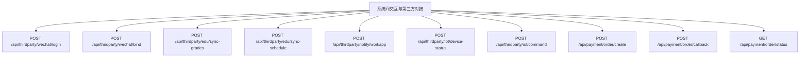
