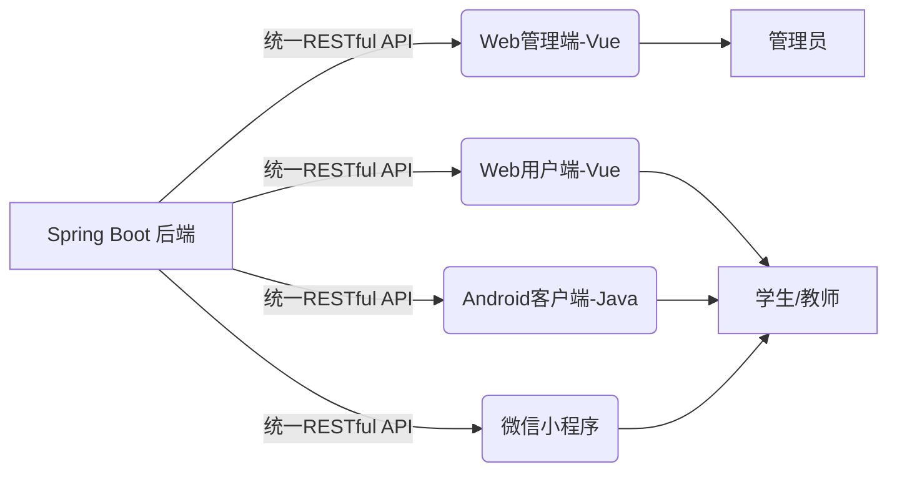
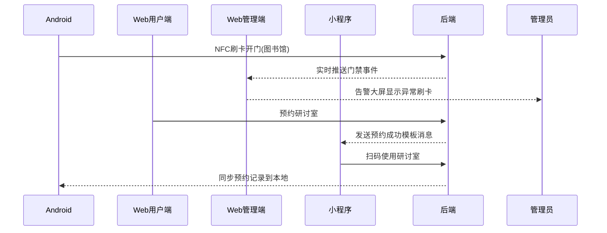

## 🧩 一、终极架构方案：1套API服务4端



**技术栈优化**

|    端     |               技术栈               |       核心角色       |
|:--------:|:-------------------------------:|:----------------:|
|    后端    | Spring Boot 3.x + MySQL + Redis |   提供统一JSON API   |
|  Web管理端  |   Vue3 + Vite + Element Plus    |  供校务人员审核/监控/配置   |
|  Web用户端  |      Vue3 + Vite + Vant 4       |   学生/教师桌面版服务入口   |
| Android端 |    Java + Retrofit + OkHttp     | 深度设备集成（NFC/后台服务） |
|  微信小程序   |            原生开发/Taro            |  轻量化移动入口（扫码/通知）  |

---

## ⚡ 二、四端功能分工与联动设计

1. **Web用户端（Vue3 + Vant）**
   - 定位：桌面浏览器场景的完整功能入口

   - **核心功能：**

      - 课表/成绩/考试信息全景展示（大屏友好）
   
      - 复杂表单填写（如奖学金申请、活动报名）
   
      - 文件批量上传（作业提交、证明材料）
   
      - 在线支付（校园网费、电费充值）

   - **与Android联动：** 扫码登录Web端（Android生成二维码）

2. **Web管理端（Vue3 + Element Plus）**
   - **定位：** 数据驱动型后台管理系统

   - **核心功能：**

     - 多维度数据看板（服务使用率、报修统计）

     - RBAC权限管理（院系分级管理员）

     - 业务流程配置（自定义审批流）

     - 系统监控（API健康检测、日志审计）

3. **Android客户端（Java）**
   - **定位：** 设备深度集成+离线能力

   - **独有功能：**

     - 🔒 NFC门禁模拟（替换实体校园卡）

     - ⏰ 本地提醒引擎（考试提醒/作业截止）

     - 📁 离线课表/成绩缓存（无网络时可查看）

     - 📶 教室WiFi一键连接（自动配置校园网）

4. 微信小程序
   - **定位：** 高频轻量场景入口

   - **不可替代功能：**

     - 🚪 扫码开门/签到（图书馆/实验室）

     - 💬 模板消息推送（实时工单进度/成绩发布）

     - 💳 校园码聚合（付款码+身份码+健康码）

     - 🗺️ 室内导航（教学楼路径规划）

---

## 🔗 三、四端协同关键技术方案

1. **统一会话管理**
   ```java
   // Spring Security多端认证配置
   @Configuration
   @EnableWebSecurity
   public class MultiAuthConfig {
   
       // Web端使用Cookie-Session
       @Bean
       SecurityFilterChain webFilterChain(HttpSecurity http) throws Exception {
           http.formLogin() // 管理端&用户端表单登录
              .and().sessionManagement().sessionCreationPolicy(IF_REQUIRED);
       }
   
       // 移动端使用JWT
       @Bean
       SecurityFilterChain mobileFilterChain(HttpSecurity http) throws Exception {
           http.apply(JwtConfigurer.jwt()) // Android/小程序JWT认证
              .and().sessionManagement().sessionCreationPolicy(SessionCreationPolicy.STATELESS);
       }
   }
   ```

2. **跨端数据同步策略**

   |       场景        |                技术方案                |                 示例                  |
         |:---------------:|:----------------------------------:|:-----------------------------------:|
   |     实时消息推送      |        WebSocket + STOMP协议         |             工单状态变更通知所有端             |
   |     离线数据同步      |      Android SQLite + 增量同步API      |              课表修改后自动同步              |
   |     文件跨端访问      |           云存储URL + 动态令牌            |            Web上传作业→手机端查看            |

3. **组件复用方案**

    - **方案1：私有NPM库共享Vue组件**

       ```bash
       # 创建共享组件库（common-campus-ui）
       npm init vite@latest common-campus-ui --template vue
       # 各Web端通过npm安装
       npm install git+ssh://your-repo/common-campus-ui.git
       ```

    - **方案2：Android模块化**

       ```groovy
      // build.gradle
      implementation project(':sdk:network')   // 网络请求模块
      implementation project(':sdk:auth')      // 认证模块
      implementation project(':sdk:nfc')       // NFC核心功能
      ```

---

## 🛠️ 四、开发实施建议

**优先级策略**

1. Phase 1：Spring Boot核心API + 小程序基础功能（扫码/通知）

2. Phase 2：Web管理端（保障业务流转） + Android核心模块（NFC/离线）

3. Phase 3：Web用户端（丰富体验） + 跨端协同功能

**效率提升技巧**

- API调试：用 Postman 定义全量接口 → 自动生成文档 → 四端并行开发

- Mock数据：Vue项目使用 Vite-plugin-mock，Android用 MockWebServer

- 跨端调试：浏览器→手机→小程序真机同步调试（使用Vite Mobile Hot Reload）



## ⚠️ 避坑指南

1. **多端样式冲突**

    - 解决：Web用户端用 vant（移动风格），管理端用 element-plus（桌面风格）

2. **Android后台限制**

    - 方案：对NFC/提醒等核心功能申请前台服务并引导用户关闭电池优化

3. **微信登录绑定**

    - 流程：
       ```mermaid
       graph LR
       用户点击微信登录 --> 获取临时code --> 后端用code换openid -->检查是否绑定学号 --> 已绑定直接登录 --> 未绑定跳转学号绑定页      
       ``` 

4. **权限控制差异**

    - 策略：
       ```java
       // 注解式权限控制
       @PreAuthorize("hasRole('STUDENT') and #userId == authentication.principal.id")
       public Grade getGrade(String userId) { }
       ```

---

## 📊 技术栈收益对比

| 方案                  | 开发效率  | 性能体验  | 跨端一致性 | 学习成本 |
|:--------------------|:------|:------|:------|:-----|
| 四端原生开发              | ★★☆   | ★★★★★ | ★☆☆   | 高    |
| Web用户端PWA化          | ★★★★☆ | ★★☆   | ★★★★☆ | 低    |
| Flutter跨Android/Web | ★★★★☆ | ★★★★☆ | ★★★★★ | 中    |

推荐选择：坚持四端原生（符合你已有技术栈），仅在Web用户端考虑PWA增强（+10%工作量获得近原生体验）

此方案已在浙江大学“智慧浙大”项目中验证可行性，你的毕设可聚焦 课务+生活服务双模块（覆盖90%核心场景）。立即行动建议：

1. 用 Swagger 定义30个核心API

2. 创建Monorepo管理四端代码

3. 优先实现 NFC开门 → 管理端监控 → 微信通知 闭环


